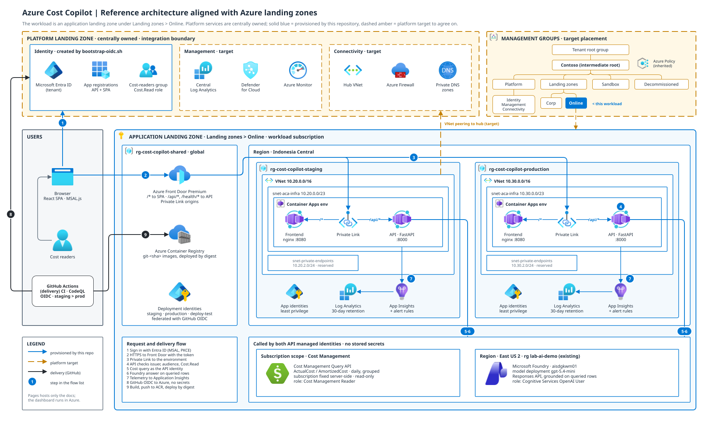

# Azure Cost Copilot: developer guide

This guide describes the **implementation in this checkout**. It is not a claim
that a new GitHub repository or a new Azure environment has been provisioned.
For the existing deployment operator sequence, use the
[workshop runbook](workshop-runbook.md). The
[architecture diagram](architecture.drawio.svg) — an SVG with Azure service
icons that also opens editable in draw.io — distinguishes resources this
repository provisions from the platform landing-zone integration.



## 1. Architecture and trust boundaries

The React SPA authenticates a user with Microsoft Entra ID through MSAL. It
requests the API's `access_as_user` delegated scope and sends the resulting
bearer token to FastAPI. The API validates issuer, audience, signing keys and
the `Cost.Read` app role before serving cost and chat requests
([frontend/src/auth/msal.ts](../frontend/src/auth/msal.ts),
[backend/src/cost_copilot/auth.py](../backend/src/cost_copilot/auth.py)).
The API uses its **own managed identity** to query the configured Azure
subscription's Cost Management Query API and invoke the configured Foundry
deployment; the user's token is not forwarded to either upstream service.
The subscription ID is server-side configuration, not a request parameter
([backend/src/cost_copilot/config.py](../backend/src/cost_copilot/config.py),
[backend/src/cost_copilot/clients/cost_management.py](../backend/src/cost_copilot/clients/cost_management.py)).

The existing infrastructure scripts configure Front Door Premium routes for
`/api/*` and `/health/*` to the API and `/*` to the nginx SPA. Staging and
production each have a Container Apps environment in the configured workload
region; the model is configured in a different region. Private-link origin
connectivity, least-privilege managed identities, monitoring, and immutable
image deployment are covered by
[infra/config/shared.env](../infra/config/shared.env),
[infra/scripts/configure-frontdoor.sh](../infra/scripts/configure-frontdoor.sh)
and [infra/scripts/verify.sh](../infra/scripts/verify.sh). The diagram's
platform-landing-zone box is an **integration boundary**, not an assertion
that a management group, hub, firewall, or platform subscription exists here.

The target landing-zone model separates centrally operated identity,
governance, connectivity and management from a workload-owned application
landing zone. Confirm policy assignments, routing, DNS, egress, diagnostics and
subscription placement with the platform team before provisioning. See
[Azure landing zones](https://learn.microsoft.com/azure/cloud-adoption-framework/ready/landing-zone/)
and [Front Door private connectivity to Container Apps](https://learn.microsoft.com/azure/container-apps/how-to-integrate-with-azure-front-door).

## 2. Repository map

| Surface | Entry points | Responsibility |
| --- | --- | --- |
| API startup | [main.py](../backend/src/cost_copilot/main.py), [config.py](../backend/src/cost_copilot/config.py) | Validate settings; install telemetry, CORS, safe errors and correlation middleware; own shared Azure credential and upstream clients for the application lifetime. |
| Cost ingestion | [costs.py](../backend/src/cost_copilot/routers/costs.py), [cost_management.py](../backend/src/cost_copilot/clients/cost_management.py) | Validate dates and groupings; query the configured subscription; bound upstream work, handle pagination, timeout and throttling. |
| Cost interpretation | [cost_service.py](../backend/src/cost_copilot/services/cost_service.py), [cost.py](../backend/src/cost_copilot/models/cost.py) | Coalesce identical queries in a 180-second process-local cache; cap distinct in-flight queries at two; calculate summary, trend and breakdown from daily rows. |
| Chat | [chat.py](../backend/src/cost_copilot/routers/chat.py), [chat_service.py](../backend/src/cost_copilot/services/chat_service.py), [foundry.py](../backend/src/cost_copilot/clients/foundry.py) | Query cost first; pass actual aggregates as grounding; only accept citations and chart actions supported by those data. |
| Browser | [main.tsx](../frontend/src/main.tsx), [CostDashboard.tsx](../frontend/src/features/dashboard/CostDashboard.tsx), [useCostData.ts](../frontend/src/features/dashboard/useCostData.ts), [useCostChat.ts](../frontend/src/features/chat/useCostChat.ts) | Entra sign-in, dashboard filters, charts, chat and error/loading states. |
| Operations | [.github/workflows/ci.yml](../.github/workflows/ci.yml), [.github/workflows/codeql.yml](../.github/workflows/codeql.yml), [.github/workflows/deploy-staging.yml](../.github/workflows/deploy-staging.yml), [.github/workflows/deploy-production.yml](../.github/workflows/deploy-production.yml) | Quality checks, static analysis, staged verification and production promotion of tested image digests. |

The only published HTTP endpoints are `GET /api/costs/summary`,
`GET /api/costs/trend`, `GET /api/costs/breakdown`, `POST /api/chat`,
`GET /health/live`, and `GET /health/ready`
([costs.py](../backend/src/cost_copilot/routers/costs.py),
[chat.py](../backend/src/cost_copilot/routers/chat.py),
[health.py](../backend/src/cost_copilot/routers/health.py)).
Readiness currently checks the local application state, **not live upstream
reachability**. The summary explicitly has no forecast: `forecast` is `null`
until a real forecasting integration is built. The `$4,000` budget shown by
the browser is a UI constant, **not an Azure budget resource**
([cost_service.py](../backend/src/cost_copilot/services/cost_service.py),
[useCostData.ts](../frontend/src/features/dashboard/useCostData.ts)).

## 3. Follow a request

1. The SPA loads a classic `/config.js` script before its module bundle. The
   nginx image renders this file from public identifiers and URLs on startup;
   `parseRuntimeConfig` rejects missing placeholders, invalid URLs and empty
   required values. Never put credentials in that script
   ([frontend/index.html](../frontend/index.html),
   [runtime-config.ts](../frontend/src/app/runtime-config.ts),
   [config.template.js](../frontend/public/config.template.js)).
2. MSAL authenticates in the browser and acquires an API-scoped token.
   `apiFetch` sends it with a correlation ID; CORS accepts only configured
   origins, not `*` ([msal.ts](../frontend/src/auth/msal.ts),
   [client.ts](../frontend/src/api/client.ts),
   [main.py](../backend/src/cost_copilot/main.py)).
3. The cost router validates an inclusive `start`/`end`, metric, grouping and
   optional `tagKey`. Its service obtains daily grouped rows, deduplicates
   simultaneous identical calls and aggregates current and previous periods.
   Cost Management failures are mapped to explicit 429, 504 or 502 responses;
   the API does not fabricate a successful result
   ([costs.py](../backend/src/cost_copilot/routers/costs.py),
   [cost_service.py](../backend/src/cost_copilot/services/cost_service.py)).
4. For chat, filters must match the active dashboard view. If the cost query
   fails the model is **not called**. If the model fails or proposes unsupported
   evidence/actions, the service returns an explicit explanation-unavailable
   answer with queried evidence. Model prose itself is **not numerically
   verified**; users must cross-check cited rows
   ([chat_service.py](../backend/src/cost_copilot/services/chat_service.py)).

## 4. Develop the frontend locally; verify the API in approved environments

The API targets Python 3.13 with `uv`, but **do not run FastAPI on a laptop
where IT policy blocks it**. Use the existing backend CI job for automated
checks and an IT-approved Azure environment for deployed API and end-to-end
verification. Keep tenant, subscription, API app ID and Foundry configuration
in the authorized environment, not in a public frontend bundle. For UI work
without running the API, use Node >=22.12 and the checked-in lockfile:

```text
cd frontend
npm ci
npm run lint
npm test
npm run build
npm run dev
```

Open the fixture preview at `frontend/preview.html` for UI changes without
an Azure login or a local FastAPI process. Run the opt-in integration and
Playwright live-API tests only in an approved environment explicitly
configured for them; see
[frontend/playwright.config.ts](../frontend/playwright.config.ts) and
[tests/e2e/](../tests/e2e/). For infrastructure validation see
[infra/tests/](../infra/tests/) and the `infrastructure` CI job.
Do not check `.env`, browser tokens, live cost screenshots or test artifacts
with spend data into a public repository.

## 5. Release and incident workflow

Feature changes target `staging`. CI checks frontend, backend, infrastructure
and container build; CodeQL scans JavaScript/TypeScript, Python and GitHub
Actions. A staging merge builds OCI images, verifies their commit labels,
resolves immutable digests, deploys and verifies the environment, then runs E2E
tests. The promotion PR is reviewed before merging to `main`; production
deploys the **tested digests** without rebuilding
([ci.yml](../.github/workflows/ci.yml),
[codeql.yml](../.github/workflows/codeql.yml),
[deploy-staging.yml](../.github/workflows/deploy-staging.yml),
[promote.yml](../.github/workflows/promote.yml),
[deploy-production.yml](../.github/workflows/deploy-production.yml)).
These files express intended gates; verify repository rulesets, GHAS feature
availability, environment reviewers, OIDC federation and successful check
runs in the *actual destination repository*. A workflow file alone does not
prove a protection rule is active.

At the time of this review, the **existing** `GithubDay` repository reported
secret scanning and push protection enabled and zero accessible code-scanning
alerts. Its API returned one active branch ruleset covering all refs, with
CodeQL `high_or_higher` and Copilot review rules, but it also permitted merge,
squash and rebase and required **zero** approving reviews. These settings
do not match the runbook's claimed merge-only, human-approved promotion.
Because production deployment expects the staging commit at the second
parent of the main-branch merge, prohibit squash/rebase and require an actual
approval before relying on that gate. No settings were changed during this
review. The proposed new repository does not yet exist, so none of these
existing-repository protections can be assumed there.

For an incident, use the browser's correlation ID to join sanitized API error
responses to Application Insights telemetry; check Front Door route/origin
health, Container App revision health, Entra app roles and identity grants,
Cost Management throttling and Foundry availability in that order. Consult
[workshop-runbook.md](workshop-runbook.md) for verification commands and
telemetry queries. Avoid logging user access tokens or model prompts with
unredacted financial details.

## 6. New repository and GitHub Pages: readiness checklist

For the complete, ordered procedure see the
[installation guide](installation.md).

The current deployment configuration and bootstrap scripts still identify
`GithubDay`; **copying them into another repository is not sufficient**.
Before any new deployment: replace repository identifiers and OIDC federated
subjects, confirm subscription and regional policies, create distinct Entra
registrations/redirect origins as appropriate, provision and verify the API,
assign its managed identity access, register the Pages origin in API CORS, and
configure runtime `config.js` with only public identifiers and the actual API
URL. Run the complete CI and live E2E flow under the destination repository.
Provisioning is billable and must be deliberately authorized.

GitHub Pages is static hosting: it **cannot** run FastAPI or substitute for
the API's access control. A project site lives below a repository prefix;
the current Vite build and `index.html` assume root-absolute `/config.js` and
default root asset paths, so publishing `frontend/dist` without adapting the
Vite base and config URL will break it. The MSAL redirect origin in this app
is `window.location.origin`; register the precise public Pages origin with
Entra and test a deep-link/redirect refresh before announcing the dashboard
as functional. Pages does not replicate Front Door private-link behavior;
the browser requires an explicitly accessible HTTPS API with an allowed CORS
origin. Publishing the documentation alone is not the requested working
dashboard; only mark the public site complete once sign-in, costs and chat
are verified end-to-end.
